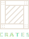
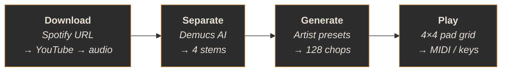

<p align="center">
  <picture>
    <source media="(prefers-color-scheme: dark)" srcset=".github/assets/crates-logo-dark.svg">
    <source media="(prefers-color-scheme: light)" srcset=".github/assets/crates-logo-light.svg">
    
  </picture>
</p>

<h3 align="center">AI-powered sample pack factory</h3>

<p align="center">
  Turn any song into an MPC-ready sample pack with one click.<br>
  50 artist presets &middot; 7 chop modes &middot; 128 pads &middot; zero configuration.
</p>

<p align="center">
  <a href="#quick-start">Quick Start</a>&ensp;&middot;&ensp;<a href="#how-it-works">How It Works</a>&ensp;&middot;&ensp;<a href="#features">Features</a>&ensp;&middot;&ensp;<a href="#roadmap">Roadmap</a>
</p>

<p align="center">
  
  
  
  
</p>

---

## Quick Start

```bash
git clone https://github.com/dnakul2000/crates.git
cd Crates
./launch.sh
```

That's it. The launcher creates the virtual environment and installs everything on first run. Subsequent launches skip straight to the app.

> **Requirements:** Python 3.10+ and an internet connection for first-time AI model downloads.

## How It Works

Crates is a four-stage pipeline — each stage is its own tab in the app:



## Features

### Artist Presets

50 presets modeled after real producers and their chopping philosophies — not genre tags, but production approaches:

| Category | Producers |
|:---------|:----------|
| Soul Flippers | Kanye, Just Blaze, RZA, Hi-Tek, 9th Wonder |
| Crate Diggers | Madlib, DJ Premier, Pete Rock, J Dilla, Alchemist |
| Boom Bap Architects | DJ Muggs, Large Professor, Havoc, Buckwild, Diamond D |
| Beat Scientists | Flying Lotus, Knxwledge, Kaytranada, Monte Booker |
| *...and 30 more* | |

Each preset defines its own chop modes, effect chains, pad mapping strategy, and sample selection criteria.

### Chop Modes

| Mode | Description |
|:-----|:------------|
| `onset` | Musical event boundaries detected by spectral flux |
| `beat_grid` | Quantized slices locked to BPM |
| `phrase` | Longer musical phrases based on structural analysis |
| `transient` | Attack-point detection for percussive material |
| `granular` | Micro-slices for texture and resynthesis |
| `syllable` | Vocal-aware segmentation |
| `random` | Controlled chaos with configurable density |

### Audio Engine

- **Quality gate** — auto-rejects stem bleed, silence, clipping, and spectral artifacts
- **Smart selection** — diversity-aware algorithm picks the most interesting 128 samples, not just the loudest
- **Group-aware normalization** — preserves dynamics between related samples (LUFS or peak, per-group)
- **Authentic effects** — Voss-McCartney vinyl crackle, tape wobble, granular resynthesis with per-grain pitch spread, perceptual intensity curves

### Output

- **24-bit WAV** files with `A01_kick_drums.wav` naming convention
- **MIDI file** (.mid) with velocity-mapped pad triggers
- **MPC program** (.xpm) for direct import into MPC Software/hardware
- **BPM and key tagging** in the pack manifest
- **Drag-and-drop** from pads directly into your DAW

### Hardware

- Auto-detects **Akai MPC Mini MK3** and other class-compliant MIDI controllers
- 16 pads × 8 banks = 128 pad slots
- Keyboard fallback for controller-free use

## Installation

### One-line launch (recommended)

```bash
./launch.sh
```

### Manual setup

```bash
python3 -m venv .venv
source .venv/bin/activate
pip install -r requirements.txt
python main.py
```

### Standalone macOS app

```bash
./build.sh
# → dist/Crates.app (drag to /Applications)
```

The built app is fully self-contained. Runtime data lives in `~/Documents/Crates/`.

## Tech Stack

| Component | Technology |
|:----------|:-----------|
| GUI | PyQt6 |
| Stem separation | Demucs (via `audio-separator`) |
| Audio analysis | librosa, scipy |
| Effects | Pedalboard (Spotify) |
| ML/classification | scikit-learn, PyTorch |
| MIDI | mido, python-rtmidi |
| Audio I/O | soundfile, sounddevice |
| Download | yt-dlp |
| Validation | Pydantic |

## Roadmap

- [ ] Universal MIDI controller support — any class-compliant controller, auto-detect, configurable mapping
- [ ] Local file import — skip the download step, drag in your own audio
- [ ] DAW export formats — Ableton Live Sets (.als), Logic Pro, FL Studio (.flp)
- [ ] AU/VST plugin — use Crates inside your DAW
- [ ] Ableton Link — tempo-sync with other apps and devices
- [ ] Batch CLI mode — process multiple songs headless

## License

This project is licensed under [CC BY-NC 4.0](https://creativecommons.org/licenses/by-nc/4.0/) — free to use, share, and modify for **non-commercial purposes**. See [LICENSE](LICENSE) for details.

## Disclaimer

Crates is provided for personal and educational use. Users are responsible for ensuring they have the rights to any audio they process. This tool does not host, distribute, or provide access to copyrighted content.
